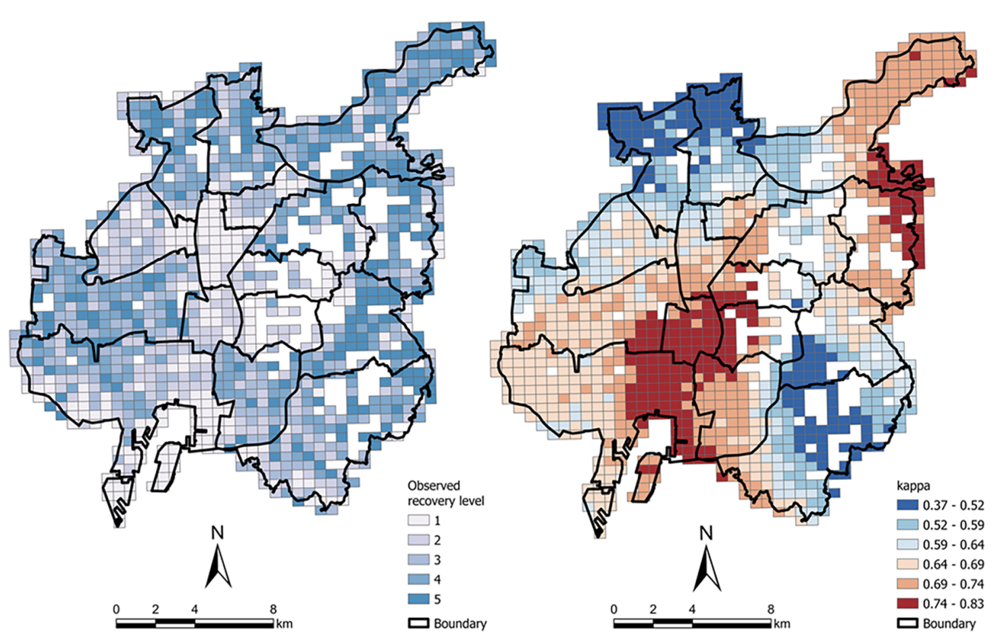

  

    <h2>COVID-19 Recovery</h2>
    

      Evaluating the social-economic recovery impacts of the built environment post-pandemic: A case study of COVID-19 in Nagoya, Japan
    

    <a href="/link/to/your/detail-page-1.html" class="learn-more-btn">Learn More</a>
  

  

    
  

  

    <h2>Cohealth Effect of Bike-sharing</h2>
    

      Synergistic health effects of bike ride in built environment and climate transformation, with a specific focus on the case study of Shenzhen, China.
    

    <a href="/link/to/your/detail-page-2.html" class="learn-more-btn">Learn More</a>
  

  

    
  

  

    <h2>项目标题 3</h2>
    

      这里是您的第三个项目简介。
    

    <a href="/link/to/your/detail-page-3.html" class="learn-more-btn">Learn More</a>
  

  

    
  

